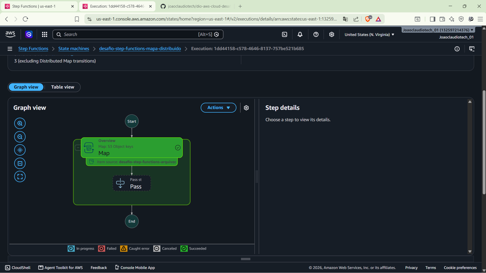
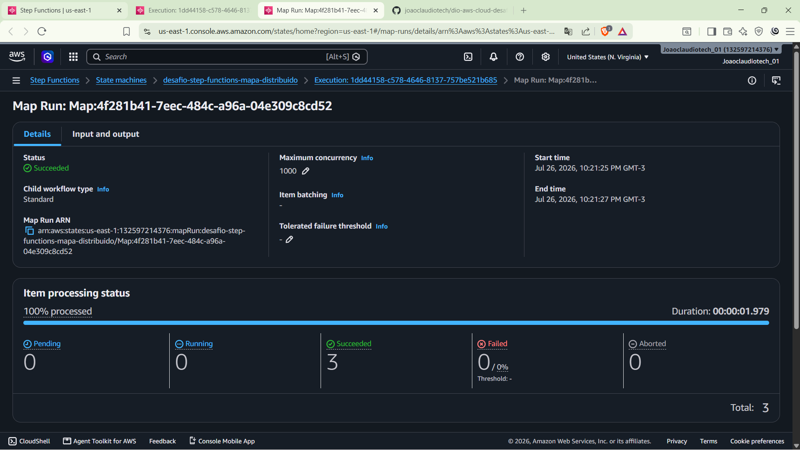

# Desafio 04 - Orquestração de Workflows com AWS Step Functions
Repositório do quarto desafio do curso Cloud com AWS da [DIO](https://www.dio.me/). O objetivo foi explorar o AWS Step Functions, serviço de orquestração de fluxos de trabalho que permite integrar e automatizar serviços da AWS (como Lambda, S3, SNS, SQS e DynamoDB) de forma visual e com pouco código, utilizando o recurso de Mapa Distribuído (Distributed Map) para processar arquivos em um bucket S3.
## O que eu aprendi

* Step Functions: serviço de orquestração que coordena a execução de múltiplos serviços da AWS através de workflows visuais (máquinas de estado), sem precisar escrever lógica de coordenação manualmente.
* State Machine: é a definição do workflow em si, composta por estados (tarefas, escolhas, paralelismos etc.) que determinam o fluxo de execução.
* Distributed Map: recurso do Step Functions que permite processar em larga escala um grande volume de itens (ex: milhares de arquivos em um bucket S3) em paralelo, sem precisar orquestrar isso manualmente.
* Integração com S3: o Distributed Map pode listar os objetos de um bucket diretamente como fonte de entrada do workflow, aplicando uma mesma lógica de processamento a cada arquivo.

## Arquitetura
Diagrama representando o workflow criado no Step Functions, com o estado de Mapa Distribuído processando os arquivos do bucket S3:

## O que eu fiz na prática

1. Criei a State Machine no Step Functions com o estado de Mapa Distribuído

2. Configurei o Mapa Distribuído para listar e processar os arquivos de um bucket S3

3. Executei o workflow e acompanhei o progresso de cada execução (Map Run)

4. Verifiquei o resultado de cada iteração do Mapa Distribuído (sucesso/falha por item processado)

5. Monitorei os logs e o histórico de execução da State Machine

## Minhas impressões
Escreva aqui, com suas palavras, o que achou mais difícil, o que ficou mais claro depois da prática e onde pretende usar esse conhecimento.

## Referências

* [AWS Step Functions - Documentação AWS](https://aws.amazon.com/pt/step-functions/)

Feito durante o curso Cloud com AWS da [DIO](https://www.dio.me/).